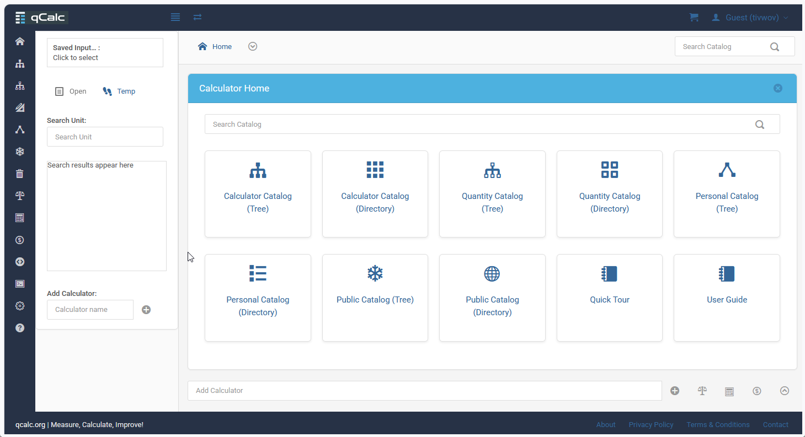

# qCalc

qCalc is an open-source Python and Django application for creating, using, and sharing calculators. It combines unit-aware calculation and conversion with a browsable calculator catalog, personal calculators, favorites, variants, examples, and rich interactive results such as tables, charts, maps, and images.

## License

qCalc is released under the [MIT License](LICENSE).

## Feature summary

- Browse and search a public **catalog of calculators**. Search and directory navigation make it easier to find calculators.
- qCalc calculators are **unit-aware by design**, allowing calculations to be performed naturally with physical quantities. Automatic unit conversion and dimensional consistency make them ideal for everything from simple arithmetic to advanced business, scientific and engineering computations.
- Create and manage **personal calculators and favorites**. Define your calculator as a Python function directly from the app interface, and qCalc automatically generates the corresponding input form and user interface.
- Create and maintain help pages with the **built-in documentation editor**. Write, edit, and manage help documentation directly within qCalc.
- **Your server. Your calculators. Your rules.** Host qCalc on your own infrastructure, create custom calculators either in the back end or entirely from the front end, and tailor the platform to your needs without being limited to the built-in collection.
- Use calculator **variants and examples** to compare or reuse calculations.
- **Share calculators** and calculations easily through links and access tokens.
- Work with **richer inputs and outputs**, including tables, charts, maps, and images.
- Enjoy a smoother experience with **better stability**, faster loading, and fewer UI bugs.
- Get **guided help** through a quick-start tour and improved documentation.
- **Fully responsive** and mobile-friendly, although a desktop is recommended for the best experience.
- Powerful. Extensible. Free!

## Overview

qCalc is an open-source, self-hosted platform for building, organizing, and sharing calculators. Run it as a Django application on your own infrastructure, start with the built-in calculator catalog, and extend it with calculators and documentation tailored to your work.

The default development setup uses SQLite, while the included configuration and deployment guides support more advanced database, cache, and production-server arrangements.

## Try qCalc online

Before setting up qCalc locally, visit [qcalc.org](https://qcalc.org) to explore qCalc in use. 
You can browse the calculator catalog, try unit-aware calculations, and experience its interactive features.


*The public instance at [qcalc.org](https://qcalc.org)*

This gives you a practical feel for qCalc before deciding whether to run and/or customize it on your own infrastructure.

## Requirements

Before installing qCalc, make sure you have:

- Python 3.12
- Git

For non-SQLite deployments, the setup scripts also mention optional support for MySQL, Redis, and Memcached.

## Installation guides

For a full step-by-step walkthrough covering Python installation, optional database and cache choices, 
and all configuration files, refer to the following guides:

1. [Set up qCalc Development System](qcalc_res/docs/admin-guide/setup-qcalc-dev-system.md)
: Recommended for a quick development environment or a setup intended for a small number of users.

2. [Set up qCalc Production Server on Docker](qcalc_res/docs/admin-guide/setup-qcalc-prod-server-on-docker.md)
: Recommended for a public-facing website, where Docker provides better isolation and security.

3. [Set up qCalc Production Server on Linux](qcalc_res/docs/admin-guide/setup-qcalc-prod-server-on-linux.md)
: Suitable for a local production deployment without Docker.
   
The installation process will:

- create a Python virtual environment in `qcalc/.venv`
- install dependencies from `qcalc/requirements.txt`
- create local configuration files under `qcalc/.setup`
- copy the default environment templates from `qcalc/setup/env`
- run database migrations
- create a default superuser account
- collect static files

## Configuration

The installation scripts create the following important files:

- `qcalc/setup.env` copied from `qcalc/setup/env/template_setup.env`
- `qcalc/.setup/dev_sqlite_file.env` copied from `qcalc/setup/env/template_dev_sqlite_file.env`
- `qcalc/gpref.json` copied from `qcalc/setup/env/template_gpref.json`

These files hold the base environment and Django settings for development. During startup, 
qCalc first reads `qcalc/setup.env`, which points to the active environment file. In a typical local setup, 
that environment file lives in the `qcalc/.setup` folder and contains the server-specific values used by Django. 
You can create your own copy of the relevant template from `qcalc/setup/env` and place it in `qcalc/.setup` 
so it is preserved locally and not overwritten by future updates.

The main environment template is `qcalc/setup/env/template_all_env_settings.env`. It documents the common startup variables, including:

- `DJANGO_DEBUG` and `DJANGO_SECRET_KEY` for Django runtime settings
- `DB_ENGINE`, `DB_NAME`, `DB_USER`, `DB_PASSWORD`, `DB_HOST`, and `DB_PORT` for database selection
- `DEFAULT_CACHE_ALIAS` and related cache settings such as Redis or Memcached
- `FILE_UPLOAD_TEMP_DIR`, `JSON_FILES_DIR`, `HELP_FILES_DIR`, `DOCS_FILE_DIR` and `AI_MODELS_DIR` for local data folders
- API keys and URLs for currency, and other services
- `DJANGO_EMAIL_BACKEND` for email handling in development or production

For local development, a copy of the relevant template under `.setup` is usually the best approach, 
while `setup.env` remains the small entry point that selects the active environment file.

## Dependency and static asset management

qCalc relies on a defined set of Python packages and frontend static assets, and the project keeps their 
versions intentionally controlled. The repository documents the expected package requirements 
in `qcalc/requirements.txt`, `qcalc/req_extra_dev.txt`, `qcalc/req_database.txt`, and `VERSIONS.md`, 
so the environment should be installed with the documented versions rather than relying on whatever 
happens to be available in the current Python environment. This helps keep the app stable across development, testing, and deployment.

All external JavaScript and CSS dependencies used by the UI are also stored locally under `qcalc/static`, 
with the correct versions of each package preserved in the repository. This makes qCalc more self-contained 
and reduces the risk of breakage caused by upstream CDN or package changes, while also improving 
reproducibility and long-term stability.

## Default development credentials

The installer creates a default superuser account:

- username: `super`
- password: `super`

It is recommended that you change the password after the first login.

## Useful development commands

From the `qcalc` directory, after activating the virtual environment:

```bash
python manage.py migrate
python manage.py createsuperuser
python manage.py collectstatic --noinput
python manage.py runserver
```

## Deployment notes

* The Docker and Linux production guides cover SSL certificate provisioning via Let's Encrypt and the two-phase Nginx configuration.
* For more advanced deployments, the repository also includes raw helper templates under `qcalc/setup/nginx` and `qcalc/setup/docker`.
* In production, review the environment templates in `qcalc/setup/env` and configure the appropriate Django settings, database, cache, and static file settings before deployment.

## Notes for local customization

- Files in `qcalc/setup` are intended as project templates and should not be edited directly.
- Local overrides should be placed under `qcalc/.setup`.
- The project includes deployment-related files under `qcalc/setup/nginx` and `qcalc/setup/docker` for more advanced setups.

## Project status

qCalc is actively developed. The public instance at [qcalc.org](https://qcalc.org) reflects the current application experience.