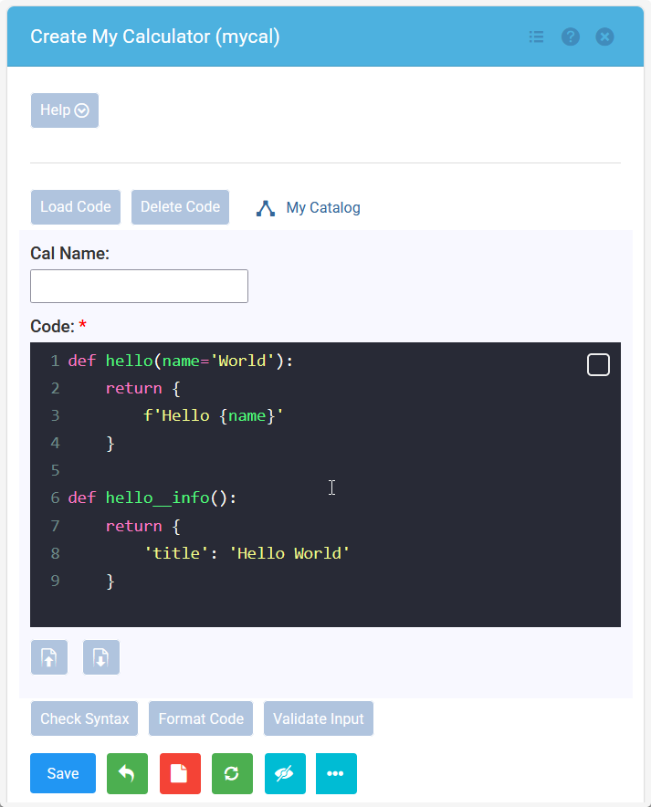
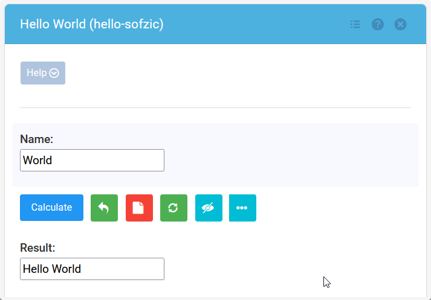
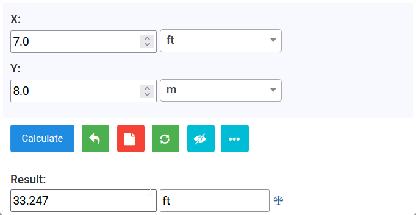
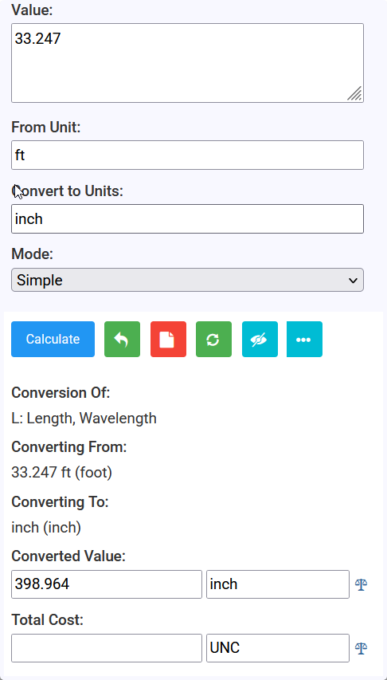

# Create Calculator: Quick Start

Some introductory knowledge of Python is a prerequisite to create a calculator in qCalc. 
You will need a basic grasp of functions and conditional logic to map out the calculation 
workflow. However, knowing the basics of operators and variables is more than enough 
to get your first script running.

## 1. Create calculator using `mycal`

Build your own calculator with `mycal` directly in the browser. `mycal` itself is a 'calculator' so you can add
it from the [Add Calculator] option from the secondary sidebar. 
The `mycal` interface provides the tools you need to create and manage your own calculators. 
Enter your calculator code and use the available options 
to check, format, validate, save, and manage your work. 

`mycal` is a mini application within qCalc that provides a Python code editor with syntax 
highlighting. It includes a syntax checker, code formatter, and code tester/validator. 
Your code can be saved only after it has passed syntax checking and validation. Once saved, 
you can also run and test your calculator.


<br>_`mycal` calculator creation user interface_<br>

When you open `mycal` it may have some default code or code remembered from previous run in it .
Click on the red **blank page** icon to clear the code window and start writing new code.

## 2. Hello World

Code snippet below creates a simple qCalc calculator. It prompts the user to enter a name. 
When **[Calculate]** button is pressed, the function returns a greeting, 
which is displayed in a textbox.

You define the function; qCalc creates the user interface. 
Its **Function-to-Form** engine takes care of the rest automatically.

Simply copy and paste the code in `mycal`. Click on **[Check Syntax]** and then **[Save]**.
Click on **[Open hello]** button (it will appear only after saving) to run your calculator.


```python
def hello(name='World'):
    return {
        f'Hello {name}'
    }

def hello__info():
    return {
        'title': 'Hello World'
    }
```


<br>_Running your first calculator_<br>

The code above follows a simple **qCalc function + metadata** structure:


### 2.1. The calculator function

```python
def hello(name='World'):
```

`hello()` is the actual calculator function. 
It defines the **inputs, processing, and output** of the calculator.

* `name` is an input field.
* `'World'` is its default value.
* The function returns the greeting.

With qCalc, you can focus entirely on your data and processing while the platform 
automatically designs and displays the form. By removing the burden of manual interface 
development, qCalc lets you write the core logic instead of spending hours building 
UI components.

### 2.2. The `__info()` function

```python
def hello__info():
```

The `__info()` function is a **special qCalc function associated with `hello()`**. 
The double underscore naming convention tells qCalc that this function contains 
**metadata describing the calculator**, rather than calculator logic.

For example:

```python
{
    'title': 'Hello World'
}
```

the key `title` provides the calculator's title. qCalc's **Function-to-Form engine** 
reads this metadata and uses it to construct and configure the user interface.

The important distinction is:

> `hello()` defines what the calculator does; `hello__info()` tells qCalc how the calculator should be presented and configured.

As the calculator becomes more sophisticated, `__info()` can contain additional metadata 
for things such as **form labels, validation, help text, layout, and other UI/behavioral settings**.

This separation is one of the key ideas behind qCalc: **you define the function, 
and qCalc automatically builds the form around it.**

## 3. Add Two Lengths

```python
def addlen(x='7 ft', y='8 m'):
    z = Qty(x)+Qty(y)
    return z


def addlen__info():
    return {
        'title': 'Add Two Lengths'
    }
```

This calculator adds two lengths, even though the inputs use different units. 
The important part of the example is `Qty()`:

```python
z = Qty(x) + Qty(y)
```

`Qty()` converts a value such as `'7 ft'` or `'8 m'` into a qCalc quantity. 
A quantity contains both a numeric value and its unit, so qCalc can check that the 
values are compatible and perform the conversion needed for the addition. 
The result is another quantity representing the combined length.

Without `Qty()`, `x` and `y` are just Python strings. Python cannot add those strings 
as lengths, because it does not know what `ft` and `m` mean. `Qty()` gives qCalc the 
unit information needed to treat them as measurements instead.

The default values are therefore two different ways of writing a length:

* `x='7 ft'` provides seven feet.
* `y='8 m'` provides eight metres.

When you run the calculator, qCalc builds unit-aware input fields from `x` and `y`.
So user can enter other lengths easily from the available units of length. It sends the 
entered values to `addlen()`, and displays `z` as the result. Try changing either 
value, or enter compatible units such as `12 inch` and `2 yd`. 

The same pattern can be used for other unit-aware calculations: 
a) turn input values into quantities with `Qty()`, b) perform the calculation, 
and c) return the quantity. 

`addlen` comes as a default code in `mycal`, so you can click on **Refresh** icon 
(green button with circular arrows) to get this default code. Alternatively, you can copy/paste as well.
Then click on **[Check Syntax]***, **[Save]** and finally **[Open addlen]** to run it.


<br>_`addlen` calculator user interface_<br>

The qCalc result section highlights your final output in a unique layout. 
Simply click the **Scale** icon to open a unit conversion tool 
pre-loaded with your result, allowing you to instantly convert the value 
to another length.


<br>_Clicking on Scale icon opens up the unit converter_<br>

For more information and examples on `Qty()`, see the 
[Quantity Reference](related-topics/quantity-reference.md).
