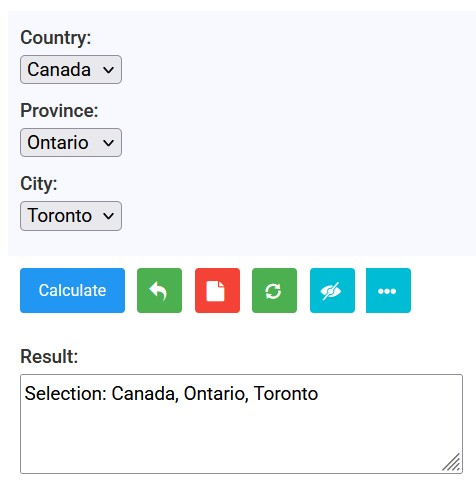

# Calculator `__info()` Metadata Guide

<!-- TOC -->
* [Calculator `__info()` Metadata Guide](#calculator-__info-metadata-guide)
  * [1. Quick Reference](#1-quick-reference)
    * [1.1 Info Keys](#11-info-keys)
    * [1.2 Schema Keys](#12-schema-keys)
  * [2. A Complete Example](#2-a-complete-example)
  * [3. Core Presentation Info Keys](#3-core-presentation-info-keys)
    * [3.1 Info Key: `title`, `desc`, and `calculate`](#31-info-key-title-desc-and-calculate)
    * [3.2 Info Key: `images`](#32-info-key-images)
    * [3.3 Info Key: `schema`: Input Widgets and Field Options](#33-info-key-schema-input-widgets-and-field-options)
      * [3.3.1 Info Key: `choice`, `radio`, and `multiplechoice`](#331-info-key-choice-radio-and-multiplechoice)
      * [3.3.2 Searchable selects, tables, and lists](#332-searchable-selects-tables-and-lists)
  * [4. Input Interaction Patterns](#4-input-interaction-patterns)
    * [4.1 `autofill`: Fill fields from a selection](#41-autofill-fill-fields-from-a-selection)
    * [4.2 `related`: Dependent selections](#42-related-dependent-selections)
    * [4.3 `showhide`: Reveal inputs only when needed](#43-showhide-reveal-inputs-only-when-needed)
    * [4.4 `anyof`: Alternative ways to provide one value](#44-anyof-alternative-ways-to-provide-one-value)
  * [5. Layout Keys](#5-layout-keys)
    * [5.1 `row`](#51-row)
    * [5.2 `col`](#52-col)
    * [5.3 `outcol`](#53-outcol)
  * [6. Follow-up Actions and Discovery](#6-follow-up-actions-and-discovery)
    * [6.1 `step2`](#61-step2)
    * [6.2 `kins` and `tags`](#62-kins-and-tags)
    * [6.3 `xpr`, `url`, and `loop`](#63-xpr-url-and-loop)
  * [7. Advanced Trusted Markup and JavaScript](#7-advanced-trusted-markup-and-javascript)
    * [7.1 `script`](#71-script)
    * [7.2 `onsubmit`](#72-onsubmit)
    * [7.3 `inserts`](#73-inserts)
    * [7.4 `template`](#74-template)
  * [8. Parameterized Metadata](#8-parameterized-metadata)
  * [9. DotDict Notation](#9-dotdict-notation)
  * [10. Author Checklist](#10-author-checklist)
<!-- TOC -->

Every qCalc calculator is a Python function with a companion metadata function named `<calculator_name>__info()`. When this function exists, qCalc considers the corresponding function (without `__info` in name) as a **calculator**.

The metadata function suffix has a double underscore followed by `info` i.e. `__info()`. The function name may or may not have underscores in it e.g. `wall_paint()` or `bmi()`, but it is recommended not to use double underscore other than metadata function.

Metadata function `__info()` returns a dictionary that controls the calculator's title, instructions, inputs, layout, and optional follow-up actions.

```python
# metadata function of the calculator named 'wall_paint'
def wall_paint__info(): 
    return {'title': 'Paint Required for a Wall'}

# calculator function named 'wall_paint'
def wall_paint(width='12 ft', height='8 ft', coats=2):
    # calculations ...
    return {'Paint needed': gallons, 'Tins to buy': tins}
```

An empty dictionary is valid, but a title is strongly recommended:

```python
def wall_paint__info():
    return {}
```

qCalc provides defaults for omitted keys. Start with `title`, `desc`, and, when needed, `schema`; add the other keys only when they make the calculator easier to use.

## 1. Quick Reference

Following table lists down the optional elements or info keys of a metadata function:

### 1.1 Info Keys
| Key | Type | Purpose |
|---|---|---|
| `title` | string | Calculator title shown to the user. |
| `desc` | string | Short explanation shown above the inputs. |
| `calculate` | string | Caption for the calculation button. |
| `schema` | dict | Per-input widget, choices, initial value, labels, and validation options. |
| `autofill` | dict | Fill several inputs after a user chooses one value. |
| `related` | dict | Build dependent selection lists, such as country -> state -> city. |
| `showhide` | dict | Show or hide inputs when another input changes. |
| `anyof` | dict | Keep only one value in each group of alternative inputs. |
| `images` | dict | Place images around the calculator. |
| `row` | list | Put named inputs on the same row. |
| `col` | list or integer | Start input columns. |
| `outcol` | list or string | Put selected output values in a second output column. |
| `step2` | list | Offer a follow-up calculator or action after a successful result. |
| `kins` | comma-separated string | Related calculators displayed in the Related section. |
| `tags` | comma-separated string | Search and catalog tags. |
| `xpr` | bool | Show or hide expression actions. Defaults to `True`. |
| `url` | bool | Show or hide the generated Browse link. Defaults to `True`. |
| `loop` | bool | Show or hide the Redo action. Defaults to `True`. |
| `script` | string | Trusted JavaScript used by client-side metadata features. |
| `onsubmit` | string | Trusted JavaScript run when the form is submitted. |
| `inserts` | dict | Trusted HTML placed at named points in the calculator template. |
| `template` | string | Advanced template override. |

Key names are case-sensitive.

### 1.2 Schema Keys

The info key `schema` can be used to define the behavior of individual fields using 
various schema keys. Some examples are given below:

| Key       | Type | Purpose                                                      |
|-----------|---|--------------------------------------------------------------|
| `type`    | string | Type of a parameter e.g. `choice`, `radio`, `checkbox`, etc. |
| `choices` | string | list of choices if the parameter type is `choice`            |
| `initial` | string | default or initial value                                     |

> For further details about the field types and schema keys please see 
[qCalc field types](related-topics/qcalc-field-types.md)

## 2. A Complete Example

```python
# following line is required for back-end calculator creation
# from qcore import Qty

# Complete example, you can copy/paste to create in front end
def wall_paint__info():
    return {
        'title': 'Paint Required for a Wall',
        'desc': 'Enter the wall size and paint coverage. The estimate includes every coat.',
        'calculate': 'Estimate',
        'schema': {
            'coats': {
                'type': 'choice',
                'choices': {1: 'One coat', 2: 'Two coats'},
            },
        },
    }


def wall_paint(width='12 ft', height='8 ft', coverage='350 sqft/gal',
               tin_size='1 gal', coats=2):
    
    width_q = Qty(width, 'ft')
    height_q = Qty(height, 'ft')
    coverage_q = Qty(coverage, 'sqft/gal')
    tin_size_q = Qty(tin_size, 'gal')

    area = width_q * height_q * int(coats)
    paint = area / coverage_q
    tins = paint / tin_size_q

    return {'Paint needed': Qty(paint, 'gal'), 'Tins to buy': tins}

```
* This calculator uses the info keys: `title`, `desc`, `calculate`, and `schema`.
* The schema for the `coats` parameter uses the keys `type` and `choices`.
* Input names, such as `coats`, in the metadata must match the corresponding function parameter names, such as `coats`.
* Choices can be specified as a dictionary of `{value: description, ...}`: `'choices': {1: 'One coat', 2: 'Two coats'}`.
* Choices can also be specified simply as a list of values: `'choices': [1, 2]`.


## 3. Core Presentation Info Keys

### 3.1 Info Key: `title`, `desc`, and `calculate`

`title` is the visible calculator name. Use an action-oriented, plain-language title:

```python
'title': 'Paint Required for a Wall'
```

`desc` appears above the form. Explain the calculation, assumptions, or a material limitation in one short paragraph:

```python
'desc': 'Enter the wall size and paint coverage. The estimate includes every coat.'
```

The default button label is `Calculate`. Change it only when a short verb (one word if possible) better fits the task:

```python
'calculate': 'Estimate'
```

Following are some examples of labels of `Calculate` button: 
`Aggregate, Calculate, Compute, Convert, Display, Estimate, Explain, Load, Open, Process, Recommend, Resize, Rotate, Save, Send, Share, Show, Solve, Upscale`, etc.

### 3.2 Info Key: `images`

`images` places one or more images at the top, bottom, left, or right of the calculator. Paths should normally be relative to calculator static files.

```python
'images': {
    'top': ['calculators/ext/circle.jpg', '<another top image>'],
    'bottom': ['<bottom image path>']
}
```

Each position accepts a list of images (e.g. you can have another image at the top section, enter it separated by comma). Use images that clarify the task, such as a wall diagram for a paint calculator.
Avoid unnecessary use of image as it may slow down the performance of your calculator.

### 3.3 Info Key: `schema`: Input Widgets and Field Options

Within the `schema`, you can specify the behavior of each parameter independently.

Without a schema, qCalc derives fields from function parameters, annotations, and default values. Use `schema` to clearly specify or customize a particular input.

```python
'schema': {
    'parameter_name': {
        'type': 'choice',
        'choices': {
            'stored_value': 'Text the user sees',
            'another_value': 'Another text',
        },
        'initial': 'stored_value',
        'label': 'Friendly field label',
        'help_text': 'Brief instruction for this input.',
        'required': True,
    },
}
```

Useful properties include `type`, `choices`, `initial`, `label`, `help_text`, `required`, `readonly`, disabled`, and `attrs`. qCalc also forwards ordinary Django-form properties such as validators and error messages where supported.

#### 3.3.1 Info Key: `choice`, `radio`, and `multiplechoice`

Use `choice`, `radio`, or `multiplechoice` for a known set of values. 
`choices` can be a list of `[values, ...]` or a dictionary of `{key:value, ...}` where key is the value passed to calculation; its value is the label shown to users.

```python
'schema': {
    'payment_frequency': {
        'type': 'radio',
        'choices': {'monthly': 'Monthly', 'yearly': 'Yearly'}, # as a dict
        'initial': 'monthly',
    },
    'services': {
        'type': 'checkboxselectmultiple',
        'choices': ['design', 'build', 'test'], # as a list of values
    },
}
```

#### 3.3.2 Searchable selects, tables, and lists

Use `qsel2` for searchable long lists:

```python
'schema': {
    'country': {
        'type': 'qsel2',
        'choices': ['Bangladesh', 'Japan', 'Canada', 'Germany', 'Australia'],
        'initial': 'Canada',
    },
}
```

For tables and repeated lists, use annotations `qtbl` and `qlist`.
user can resize these input controls during data entry. For tables, user can specify number of columns and rows.
For list user can add and remove rows.

```python
def material_cost__info():
    return {
        'title': 'Material Cost Schedule',
        'schema': {
            'items': {
                'initial': {
                    "columns": ["Item", "Quantity", "Unit Cost"],
                    "data": [
                        ["Brick", "3650 nos", "0.01 USD/nos"],
                        ["Sand", "100 cft", "3.5 USD/cft"],
                        ["Cement", "20 bag", "7.2 USD/bag"],
                    ]
                },
            },
        }
    }


def material_cost(items: qtbl):
    return items
```

* `qtbl` is the safer table annotation and accepts a plain `{'columns': ..., 'data': ...}` dictionary.
* Backend calculators can also use a full pandas DataFrame-compatible table with the `qtable` annotation.
* For frontend calculators, use `qtbl`, which is a lightweight version that mimics a pandas DataFrame.

## 4. Input Interaction Patterns

### 4.1 `autofill`: Fill fields from a selection

Use `autofill` when a selected product, material, or preset supplies known values:

```python
'schema': {
    'brand': {
        'type': 'choice',
        'choices': ['standard', 'premium'],
        'initial': 'standard',
    },
},
'autofill': {
    'brand': { # autofill when brand is changed
        'fields': ['coverage', 'tin_size'], # autofill these fields
        'values': {
            'standard': ['350', '1'], # autofill with these values when brand is standard
            'premium': ['425', '1'], # values are in field order
        },
    },
},
```

* The `fields` order must match the value order in every `autofill` entry.
* You can fill in values of a quantity field.
* Sometimes it is better to make the those fields readonly which are automatically filled.

### 4.2 `related`: Dependent selections

Use `related` for country -> state -> city, department -> team -> employee, and similar chains.


```python
# Complete example, you can copy/paste to create in front end
def demo_related__info():
    return {
        'title': 'Demonstrating related metadata',
        'related': {
            'address': { # this is an arbitrary name of the group
                'fields': { # fields that are related
                    'country': 'Canada', # initial value of country
                    'province': 'Ontario', 
                    'city': 'Toronto',
                },
                'relation': { # how field values are related
                    'Canada': { # each country relates to provinces
                        'Ontario': ['Toronto', 'Ottawa'], # province relates to cities
                        'Quebec': ['Montreal', 'Quebec City'],
                    },

                    'USA': {'California': ['Los Angeles', 'San Diego']},
                },
            },
        },
    }


def demo_related(country, province, city):
    return f'Selection: {country}, {province}, {city}'
```

*Fig: How the 'demo_related' calculator looks inside qCalc*

* The current implementation supports up to four levels of dependency (e.g. country, state, city, zipcode). 
* Do not put the same field in both `related` and `anyof` or `showhide`; these features can compete for control of it.

### 4.3 `showhide`: Reveal inputs only when needed


```python
'showhide': {
    'rate_mode': { # field that determines other field's viibility
        'fields': ['custom_rate'], # list of fields to show/hide
        'callback': 'showCustomRate' # callback function name
    },
},
'script': '''
function showCustomRate(value) { # callback JavaScript function
    return [value === 'custom']; # value of rate_mode passed at runtime
}
''',
```
* Use `showhide` to keep some fields visible or hidden when necessary.
* For typical forms, use a tiny JavaScript callback using `script` key. The callback receives the controlling value and returns one Boolean for every field: `true` shows it; `false` hides it.
* For one simple rule, qCalc also supports a compact callback such as `'callback': "@=='custom'"`. 
Prefer a named callback function for anything more complex. 
* Use the special `__` key to hide a list of fields unconditionally:

```python
'showhide': {'__': {'fields': ['internal']}}
```

### 4.4 `anyof`: Alternative ways to provide one value

Suppose you want to calculate the area of a circle by providing either the radius or the diameter. You can use the `anyof` key to ensure that only one value is specified, which clears the other input.

```python
'anyof': {
    'circle_size': { # arbitrary group name
        'fields': ['radius', 'diameter'] # list of alternative fields
    },
}
```

* Use `anyof` when inputs are alternatives. When a user enters one value, qCalc clears the other fields in that group.
* `circle_size` here is an arbitrary group name. You may define several groups of fields.

## 5. Layout Keys

qCalc normally displays inputs in one column. Use layout options to change this.

### 5.1 `row`

`row` groups fields on the same row. Join field names (from one field to another in parameter list) with hyphens:

```python
# field width to height in one row
# field coverage to tin_size in another row
'row': ['width-height', 'coverage-tin_size']
```

### 5.2 `col`

`col` starts new input columns. It accepts an integer count or field group specifications:

```python
'col': 2
```

```python
'col': ['length-width', 'height-depth']
```

* Use `row` and `col` only when necessary and when they fit on the screen.
* Use `col` when the result remains readable on narrow screens.
* A single-column layout (default) is recommended, as it allows multiple calculators to fit on the screen.


### 5.3 `outcol`

```python
# Complete example, you can copy/paste to create in front end
def mypie__info():
    return {
        'title': 'My Pie Chart',
        'outcol': ['chart__r'],
    }


def mypie(mychart: qfunc = pie_chart):
    # pie_chart is a qcalc function, It's interface is being reused here.
    # Nesting function is a powerful qCalc feature
    return {
        'chart': mychart['chart']
    }
```
* `outcol` moves output fields into a second output column.
* Use `outcol` for charts, tables, long explanations, or results that deserve separate visual emphasis.
* For output parameter names, qCalc converts the return label to lowercase, replaces spaces with underscores, and adds `__r`. For example, `chart` becomes `chart__r`, while `Monthly payment` becomes `monthly_payment__r`. Therefore, use `'outcol': ['chart__r']` for a return label of `chart`.
* If you do not see the chart in the second column, close other cards/calculators and keep only your calculator open to view the result.

## 6. Follow-up Actions and Discovery

### 6.1 `step2`

`step2` adds buttons after a successful calculation. Every item has `step`, `caption`, and `spec`; a `run` action also needs `func`.

`'step': 'run'` to open another calculator (in the following example `bmr`) with parameter values pre-filled with current result:

```python
'step2': [
    {
        'step': 'run',
        'func': 'bmr',
        'caption': 'Calculate BMR',
        'spec': {'weight': 'weight', 'height': 'height'},
    },
],
```

`'step': 'cost'` to estimate costs from returned quantity values. `include` and `exclude` select current output labels; `'*'` includes all outputs before exclusions:

```python
'step2': [
    {
        'step': 'cost',
        'caption': 'Calculate Material Cost',
        'spec': {'include': ['*'], 'exclude': ['Work Volume']},
    },
],
```

`'step': 'chart'` to open a returned qCalc chart object in its chart calculator:

```python
'step2': [
    {
        'step': 'chart', 
        'caption': 'Explore chart', 
        'spec': {'field': 'chart'},
    },
],
```

### 6.2 `kins` and `tags`

`kins` lists related calculator IDs. qCalc resolves each one to its visible title:

```python
'kins': 'bmi, bmr, calorie'
```
Only include real, useful next calculators.

`tags` makes a calculator easier to find in catalog search:

```python
'tags': 'mortgage, loan, finance, monthly payment'
```

Only include short phrases a user would search for.

### 6.3 `xpr`, `url`, and `loop`

These switches control standard after-calculation controls:

```python
'xpr': False,   # Hide eva expression link.
'url': False,   # Hide the generated Browse link.
'loop': False,  # Hide the Redo action.
```

All default to `True`. qCalc automatically disables looping for rich results such as tables, charts, images, pages, and long text.

## 7. Advanced Trusted Markup and JavaScript

### 7.1 `script`

`script` is inserted as JavaScript on the calculator page, most often to provide a `showhide` callback. 
Treat it as reviewed application code. Do not place untrusted user text in it.

### 7.2 `onsubmit`

`onsubmit` runs in a jQuery submit handler immediately before the form is submitted. The calculator instance ID is available as `_cid`.

```python
'onsubmit': '''
if (!document.getElementById('id_' + _cid + '_email').value) {
    alert('Enter an email address before requesting this quote.');
    event.preventDefault();
}
''',
```

Use server-side validation for rules that protect data or business logic; browser code can be bypassed.

### 7.3 `inserts`

`inserts` renders trusted HTML at standard template positions: `card_top`, `form_top`, `form_bottom`, `out_top`, and `out_bottom`.

```python
'inserts': {
    'form_top': '<p>Measurements may be entered in ft, m, or cm.</p>',
    'out_bottom': '<p>Round up when buying full tins.</p>',
},
```

For reusable links and command buttons, prefer helpers such as `cal_link`, `page_link`, and `command_button` rather than 
constructing URLs and HTML by hand. Never interpolate untrusted content into an insert.

### 7.4 `template`

`template` selects a project-specific calculator template:

```python
'template': 'v4.27'
```

This is an advanced integration option. Most calculator authors should use the configured default.

## 8. Parameterized Metadata

An `__info()` function may accept a parameter named `__info` as well which can be thought of as a dynamic mode selector.
qCalc passes this selected mode when the calculator is opened. It is useful when the mode changes available choices, 
such as length versus weight conversion.

```python
def unit_converter__info(__info=None):
    category = (__info or 'length').lower()
    choices = {
        'length': {'m': 'Metres', 'ft': 'Feet'},
        'weight': {'kg': 'Kilograms', 'lb': 'Pounds'},
    }[category]
    return {
        'title': f'{category.title()} Unit Converter',
        'schema': {'from_unit': {'type': 'choice', 'choices': choices}},
    }
```

The calculator function may also accept `__info` if it needs the selected mode during calculation.

## 9. DotDict Notation

For an easier and more readable way to create the dictionary returned by `__info()`, calculator authors can use qCalc's `dd()` (`DotDict`) helper. It allows nested information to be defined using dot notation, reducing the need for `{}` and making complex `__info()` structures easier to read. 

> See **[qCalc DotDict notation: Using `dd()` in `__info()`](related-topics/dot-dict-notation.md)** for examples and usage.


## 10. Author Checklist

1. Define `<calculator_name>__info()` beside the calculator function.
2. Add a plain-language `title` and a concise `desc` when the calculation needs context.
3. Match every metadata field name to a parameter exactly.
4. Use `schema` for meaningful choices, labels, help text, and widgets.
5. Test every `autofill`, `related`, `showhide`, and `anyof` interaction in a browser.
6. Return correctly named outputs.
7. Use JavaScript and HTML hooks only for trusted, reviewed code.
8. Use user-friendly tags and titles that make the calculator discoverable.


