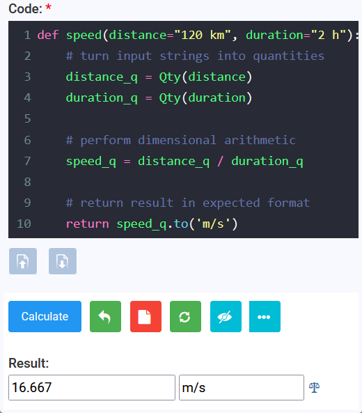

# Quantity Reference
<!-- TOC -->
* [Quantity Reference](#quantity-reference)
* [1. Measure using `Qty`](#1-measure-using-qty)
  * [2. Constructing quantities](#2-constructing-quantities)
    * [2.1 From a quantity string](#21-from-a-quantity-string)
    * [2.2 From a value and unit](#22-from-a-value-and-unit)
    * [2.3 Parse and convert in one step](#23-parse-and-convert-in-one-step)
    * [2.4 Multi-part values](#24-multi-part-values)
    * [2.5 Value not yet supplied](#25-value-not-yet-supplied)
  * [3. Reading a quantity](#3-reading-a-quantity)
  * [4. Arithmetic and dimensions](#4-arithmetic-and-dimensions)
    * [4.1 Addition and subtraction](#41-addition-and-subtraction)
    * [4.2 Multiplication and division](#42-multiplication-and-division)
    * [4.3 Powers and mathematical functions](#43-powers-and-mathematical-functions)
    * [4.4 Comparisons and truthiness](#44-comparisons-and-truthiness)
  * [5. Converting units](#5-converting-units)
    * [5.1 `.to(unit)`](#51-tounit)
    * [5.2 `.to_units(units)`](#52-to_unitsunits)
    * [5.3 `.in_units_of(*units)` and `.as_units(units)`](#53-in_units_ofunits-and-as_unitsunits)
    * [5.4 Standard systems and base units](#54-standard-systems-and-base-units)
  * [6. Formatting and small helpers](#6-formatting-and-small-helpers)
    * [6.1 Rounding](#61-rounding)
    * [6.2 Missing value normalization](#62-missing-value-normalization)
    * [6.3 Compatibility and category](#63-compatibility-and-category)
  * [7. Practical patterns](#7-practical-patterns)
    * [7.1 Normalize inputs, calculate with scalars, restore units](#71-normalize-inputs-calculate-with-scalars-restore-units)
    * [7.2 Keep quantities through the formula](#72-keep-quantities-through-the-formula)
    * [7.3 Preserve the caller's output convention](#73-preserve-the-callers-output-convention)
  * [8. Common mistakes](#8-common-mistakes)
  * [9. API summary](#9-api-summary)
<!-- TOC -->
# 1. Measure using `Qty`

`Qty` represents a numeric value together with a unit of measure. 
It is the normal quantity type for calculator authors. Import it from `qcore` if you are 
creating backend calculator:

```python
from qcore import Qty
```

For frontend calculator, you do not need to import it.

Use `Qty` at the input and output boundaries of a calculator: 
- turn input strings into quantities 
- perform dimensional arithmetic, and 
- return quantities in expected format.

```python
def speed(distance="120 km", duration="2 h"):
    # turn input strings into quantities
    distance_q = Qty(distance)
    duration_q = Qty(duration)
    
    # perform dimensional arithmetic
    speed_q = distance_q / duration_q
    
    # return result in expected format
    return speed_q.to('m/s')

speed() # run the function
```

The result is `16.667.0 m/s`. You can copy the code above and paste in qCalc `eva`
and give it a try:



 > **Tip:** Instead of using `Qty()`, you can use its shortcut, `q()`, in your expression or calculator code. 
 For example, use `q('5m')` instead of `Qty('5m')`.
 
By the way you can have either double quote (") or single quote (') around the string as it is normal 
in python. So q('5m') and q("5m") does the same thing.

## 2. Constructing quantities

### 2.1 From a quantity string

The usual form is a number followed by a valid unit expression:

```python
length = Qty("2.5 m")
rate = Qty("72 km/h")
area = Qty("12 ft^2")
mass_density = Qty("2400 kg/m^3")
```

Numbers may be signed, decimal, or use scientific notation:

```python
tiny = Qty("1e-6 m")
debt = Qty("-25 USD")
```

The unit expression is resolved by qCalc's unit catalog. Use `*`, `/`, `^`, or `**` 
to combine and power units. 
For example, `m/s^2`, `N*m`, `kg/m^3`, and `ft**2` are valid forms.

### 2.2 From a value and unit

Pass a Python number and a valid unit string when the number is computed in your calculator:

```python
radius = Qty(12, "cm")
volume = Qty(4 / 3 * 3.14159 * radius.val ** 3, "cm^3")
```

This is particularly useful for returning a calculated scalar with its unit:

```python
return {"Monthly Cost": Qty(monthly_cost, "USD/mo")}
```

### 2.3 Parse and convert in one step

Supply a target unit as the final argument. The resulting object is already converted:

```python
height_cm = Qty("5 ft, 10 inch", "cm")
distance_km = Qty(5280, "ft", "km")
area_m2 = Qty(900, "ft^2", "m^2")
```

`Qty(existing_qty, "unit")` is also supported:

```python
distance = Qty("3 mi")
distance_km = Qty(distance, "km")
```

For normal input strings, prefer `Qty(value).to("unit")` when the conversion is part of the calculation flow; 
it makes the operation obvious to the reader.

### 2.4 Multi-part values

A comma-separated string is treated as a sum of compatible quantities. 
This is convenient for human-friendly durations and lengths:

```python
duration = Qty("1 hr, 45 min, 30 sec")
height = Qty("5 ft, 10 inch")
angle = Qty("23 deg, 26 mina, 22 seca")

print(duration.to("min"))    # 105.5 min
print(height.to("inch"))     # 70.0 in
print(angle.to("deg"))       # 23.44 deg
```
> **Note:** qCalc defines minute of arc as `mina` and second of arc as `seca` to distinguish them from the duration units `min` and `sec`.

Each part must be a valid quantity, and the parts must be dimensionally compatible. Comma-separated parsing is for input strings; use ordinary `+` in calculator logic.

### 2.5 Value not yet supplied

The `@` prefix creates a quantity whose value is `None` and whose unit is known:

```python
unit_cost = Qty("@USD/m")
unknown_length = Qty("@ft")
```

This is useful for optional quantity fields or placeholder results. 
`.to(...)` preserves the missing value while changing its unit. 
Do not perform ordinary arithmetic with a missing value unless 
the specific code path handles it; use `.val is None` to test it first.

## 3. Reading a quantity

`Qty` exposes two author-facing properties:

| Property | Meaning | Example                         |
| --- | --- |---------------------------------|
| `.val` | Numeric value in the quantity's current unit | `Qty("2 ft").val` is `2.0`      |
| `.uom` | Current unit expression as a string | `Qty("2 ft/s").uom` is `"ft/s"` |

Use `.val` only after you have normalized to the unit required by the formula. 
This avoids mixing raw values from different units:

```python
height_m = Qty('6ft', "m").val
weight_kg = Qty('170lb', "kg").val
bmi = weight_kg / height_m ** 2
print(bmi.val)
```

`str(qty)` produces the value and unit, suitable for simple display or text output:

```python
str(Qty("2.5 m"))  # "2.5 m"
```

## 4. Arithmetic and dimensions

### 4.1 Addition and subtraction

Both operands must be quantities with compatible dimensions. 
The result uses the left operand's unit.

```python
total = Qty("2 m") + Qty("30 cm")
print(total)  # 2.3 m

remaining = Qty("1 h") - Qty("15 min")
print(remaining)  # 0.75 h
```

Adding a quantity to a scalar, or adding incompatible quantities 
such as metres and seconds, raises `TypeError`.

### 4.2 Multiplication and division

Multiply or divide by a number to retain the original unit. 
Multiply or divide two quantities to create the appropriate compound unit.

```python
area = Qty("3 m") * Qty("2 m")
speed = Qty("100 km") / Qty("2 h")
discounted = Qty("25 USD") * 0.9
```

If quantity multiplication or division cancels every dimension, 
qCalc returns a `plain numeric` value rather than a `Qty`:

```python
ratio = Qty("150 cm") / Qty("1.5 m")
assert ratio == 1.0

periods = int(Qty("5 yr") / Qty(1, "mo"))
assert periods == 60
```

Wrap a scalar back in `Qty` when you want to give the result an explicit unit:

```python
rate_percent = Qty(annual_rate * 100, "pct/yr")
```

### 4.3 Powers and mathematical functions

Raise a quantity only to a dimensionless exponent:

```python
area = Qty("3 m") ** 2
side = Qty("9 m^2").sqrt()
```

For trigonometry, use the quantity methods. They accept angle units and return plain numeric values:

```python
rise = Qty("30 deg").sin() * run.val
```

Qty() object's `sin()`, `cos()`, and `tan()` require an angular unit and raise `TypeError` for other dimensions.
for numeric values you can use math's function

```python
x = Qty('90 deg').sin()
y = math.sin(pi/2) # or simply sin(pi/2) in eva
print(x, y)
```

### 4.4 Comparisons and truthiness

Quantities can be compared only with compatible quantities:

```python
if Qty("3 ft") < Qty("1 m"):
    ...
```

`bool(qty)` is false when its value is zero. Test missing values explicitly because `Qty("@m")` is not a useful substitute for a boolean condition:

```python
length = Qty(user_length)
if length.val is None:
    return {"Length": Qty("@m")}
```

## 5. Converting units

### 5.1 `.to(unit)`

`.to(...)` returns a new quantity in the requested compatible unit. It does not mutate the original object.

```python
distance = Qty("3 mi")
distance_km = distance.to("km")

assert distance.uom == "mi"
assert distance_km.uom == "km"
```

### 5.2 `.to_units(units)`

`.to_units(...)` returns a list containing one converted quantity per requested unit. 
Pass either a comma-separated string or a list of unit strings:

```python
speed = Qty("60 mph")
alternatives = speed.to_units("km/h, m/s")
# [Qty(..., "km/h"), Qty(..., "m/s")]
```

### 5.3 `.in_units_of(*units)` and `.as_units(units)`

`.in_units_of(...)` expresses one quantity across multiple compatible units, 
from largest to smallest, and returns a tuple. This is best for a duration or mixed-unit display:

```python
parts = Qty("3670 s").in_units_of("h", "min", "s")
# (Qty(1.0, "h"), Qty(1.0, "min"), Qty(10.0, "s"))
```

`.as_units(...)` returns the same expression in display-ready form. 
It accepts a comma-separated string or a list. `.as_(...)` is an alias.

```python
display = Qty("3670 s").as_units("h, min, s")
# "1.0 h, 1.0 min, 10.0 s"
```

With one requested unit, `in_units_of("cm")` returns one `Qty`, not a tuple. 
Use `.to("cm")` when conversion, rather than decomposition, is what you mean.

### 5.4 Standard systems and base units

These helpers return an equivalent quantity expressed in standard units for its dimensions:

| Method | System |
| --- | --- |
| `.si()` or `.mks()` | SI / MKS |
| `.fps()` | Foot-pound-second |
| `.cgs()` | Centimetre-gram-second |
| `.in_base_units()` | qCalc base-unit expression |

```python
force = Qty("10 lbf")
force_mks = force.mks()
force_fps = force.fps()
print(force, force_mks, force_fps)
```

Use these for standardized outputs, diagnostics, or when a formula specifically requires a system. 
For normal calculator results, choose the unit your users expect and call `.to(...)`.

## 6. Formatting and small helpers

### 6.1 Rounding

`.roundoff(decimals=0)` rounds the quantity in place and returns that same object.

```python
result = Qty("3.14159 m").roundoff(2)
print(result)  # 3.14 m
```

Because it mutates, do not call it on a quantity you also need at full precision. 
Convert or copy first:

```python
rounded = Qty(original).roundoff(1)
```

### 6.2 Missing value normalization

`.nzq()` changes a missing (`None`) value to `0.0` in place:

```python
optional_fee = Qty("@USD")
optional_fee.nzq()
# now 0.0 USD
```

Use this only when zero is the intended business meaning of an omitted value.

### 6.3 Compatibility and category

```python
speed = Qty("10 m/s")
speed.is_compatible("km/h")  # True
speed.is_compatible("kg")    # False

speed.category()              # dimension/category description
```

`.is_compatible(unit)` is a useful guard when a calculator accepts a user-selected output unit.


## 7. Practical patterns

### 7.1 Normalize inputs, calculate with scalars, restore units

This pattern is useful when the formula is naturally scalar but inputs may use different units:

```python
def body_mass_index(weight="70 kg", height="175 cm"):
    weight_kg = Qty(weight, "kg").val
    height_m = Qty(height, "m").val
    return {"BMI": weight_kg / height_m ** 2}
```

### 7.2 Keep quantities through the formula

This pattern lets qCalc carry dimensions for you:

```python
def rectangular_volume(length="2 m", width="50 cm", height="1 m"):
    volume = Qty(length) * Qty(width) * Qty(height)
    return {"Volume": volume.to("l")}
```

### 7.3 Preserve the caller's output convention

Read `.uom` when the result should follow the unit used by the caller:

```python
def double_length(length="3 ft"):
    input_length = Qty(length)
    return {"Double Length": Qty(2 * input_length.val, input_length.uom)}
```

## 8. Common mistakes

| Avoid | Use instead |
| --- | --- |
| `Qty("2 m") + 3` | `Qty("2 m") + Qty("3 m")` |
| Using `.val` before conversion | `Qty(value, "required_unit").val` |
| Assuming `.to(...)` changes the current object | Assign its return: `q = q.to("m")` |
| Treating a cancelled ratio as a `Qty` | Expect a plain number from `Qty("1 m") / Qty("1 m")` |
| Rounding a shared quantity unintentionally | Copy first: `Qty(q).roundoff(2)` |
| Applying `math.sin(Qty("30 deg"))` | Use `Qty("30 deg").sin()` |

## 9. API summary

| API | Returns | Mutates receiver |
| --- | --- | --- |
| `Qty("number unit")` | `Qty` | No |
| `Qty(value, "unit")` | `Qty` | No |
| `Qty(value, "from", "to")` | converted `Qty` | No |
| `.to("unit")` | converted `Qty` | No |
| `.to_units("u1, u2")` | `list[Qty]` | No |
| `.in_units_of("u1", "u2")` | `Qty` or `tuple[Qty, ...]` | No |
| `.as_units("u1, u2")` / `.as_(...)` | `Qty` or display string | No |
| `.si()`, `.mks()`, `.fps()`, `.cgs()` | `Qty` or tuple for decomposed units | No |
| `.in_base_units()` | `Qty` | No |
| `.roundoff(decimals)` | same `Qty` | Yes |
| `.nzq()` | `None` | Yes |
| `.sqrt()` | `Qty` | No |
| `.sin()`, `.cos()`, `.tan()` | number | No |

> For form-field annotations that select units, see [qCalc field types](qcalc-field-types.md). For the complete calculator lifecycle and metadata hooks, see the [qCalc calculator author guide](../qcalc-author-guide.md).