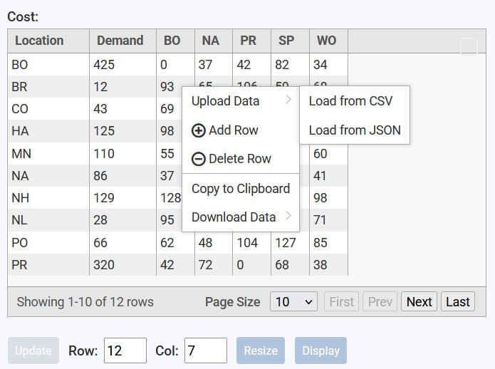
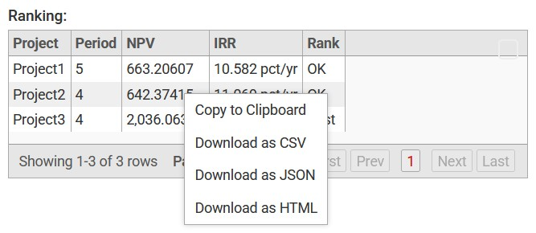

# qCalc Input and Output Table
<!-- TOC -->
* [qCalc Input and Output Table](#qcalc-input-and-output-table)
  * [1. What these two tables are](#1-what-these-two-tables-are)
  * [2. Input table basics](#2-input-table-basics)
    * [2.1 Enter data in cells](#21-enter-data-in-cells)
    * [2.2 Keyboard and mouse behavior in Edit mode](#22-keyboard-and-mouse-behavior-in-edit-mode)
    * [2.3 Save/apply edited table data](#23-saveapply-edited-table-data)
    * [2.4 Switch between Edit and Display mode](#24-switch-between-edit-and-display-mode)
  * [3. Change column header names](#3-change-column-header-names)
  * [4. Input table context menu](#4-input-table-context-menu)
    * [4.1 Actions available in Edit mode](#41-actions-available-in-edit-mode)
    * [4.2 Actions available in Display mode](#42-actions-available-in-display-mode)
  * [5. Output table context menu](#5-output-table-context-menu)
  * [6. Resize rows and columns](#6-resize-rows-and-columns)
  * [7. Limits for rows and columns](#7-limits-for-rows-and-columns)
  * [8. Pagination and page movement](#8-pagination-and-page-movement)
  * [9. Maximize and restore normal view](#9-maximize-and-restore-normal-view)
  * [10. Upload workflows](#10-upload-workflows)
    * [10.1 Load from CSV (Input table, Edit mode)](#101-load-from-csv-input-table-edit-mode)
    * [10.2 Load from JSON (Input table, Edit mode)](#102-load-from-json-input-table-edit-mode)
  * [11. Copy and download data](#11-copy-and-download-data)
  * [12. Common troubleshooting](#12-common-troubleshooting)
  * [13. Quick reference](#13-quick-reference)
<!-- TOC -->
## 1. What these two tables are

### Input table
  * Used to enter, edit, resize, and upload tabular data for calculations.
  * Supports Edit and Display modes.

### Output table
  * Used to review calculation results.
  * Read-only table with copy and download actions.

Both tables use page-based viewing with local pagination.

## 2. Input table basics

*Fig: qCalc input table*

### 2.1 Enter data in cells

1. Ensure the table is in Edit mode.
2. Click a cell.
3. Type your value.
4. Press Enter or click another cell.

When you change a cell, the Update button becomes enabled.

### 2.2 Keyboard and mouse behavior in Edit mode

The input table uses spreadsheet-style movement in Edit mode.

Keyboard:
- Tab: move to next cell
- Shift + Tab: move to previous cell
- Enter: move to next row in the same column; at the bottom row, move to the top cell of the next column
- Shift + Enter: move to previous row in the same column
- Typing in an active cell editor replaces the full selected value

Mouse:
- Click a cell to start editing
- Double-click inside the editor to select the full cell value

Notes:
- These keys and mouse actions apply local cell edits only.
- Final apply/save is still done by clicking Update.

### 2.3 Save/apply edited table data

1. Edit one or more cells.
2. Click Update.

Use Update after cell edits, row changes, or header title changes.

### 2.4 Switch between Edit and Display mode

- Click the Edit or Display button below the table.
- In Edit mode:
  - cell editing is enabled,
  - header title editing is enabled,
  - edit-only context menu options are available.
- In Display mode:
  - table is read-only,
  - only copy/download context menu actions remain.

## 3. Change column header names

Column header rename is available in Edit mode.

1. Switch to Edit mode.
2. Click the header title text you want to rename.
3. Type the new title.
4. Confirm by pressing Enter or clicking outside.
5. Click Update to apply the new table state.

## 4. Input table context menu

Open the context menu by right-clicking a row.

### 4.1 Actions available in Edit mode

- Upload Data:
  - Load from CSV
  - Load from JSON
- Add Row
- Delete Row
- Copy to Clipboard
- Download Data:
  - Download as CSV
  - Download as JSON
  - Download as HTML

### 4.2 Actions available in Display mode

- Copy to Clipboard
- Download Data:
  - Download as CSV
  - Download as JSON
  - Download as HTML

## 5. Output table context menu

*Fig: qCalc output table*

Open the context menu by right-clicking a row.

Available actions:
- Copy to Clipboard
- Download as CSV
- Download as JSON
- Download as HTML

Output table is read-only and does not support editing/resizing controls.

## 6. Resize rows and columns

Row and column fields are shown below the input table.

1. Enter target Row value.
2. Enter target Col value.
3. Click Resize.

Behavior:
- Values are clamped to at least 1.
- Resize triggers a full table refresh.
- In Edit mode, use Update after additional edits.

## 7. Limits for rows and columns

Current enforced resize limits:

- Maximum columns: 125
- Maximum total cells: 50,000
- Maximum total rows = floor(50,000 / columns)

Examples:

- columns = 5 -> max rows = 10,000
- columns = 10 -> max rows = 5,000
- columns = 125 -> max rows = 400

Important behavior note:

- Resize operations are capped by the formula above.
- CSV import can load larger datasets than this limit.

## 8. Pagination and page movement

Both input and output tables are paginated.

Default settings:
- Default page size: 10 rows
- Page size options: 5, 10, 25, 50, 100, 250

How to move between pages:
1. Use the pagination controls at the bottom of the table.
2. Use next/previous page controls to move through data.
3. Change page size using the size selector.

Practical tips:
- For large tables, keep smaller page sizes for faster interaction.
- Increase page size when you want fewer page switches.

## 9. Maximize and restore normal view

Each table has a maximize toggle icon (square icon) at the top-right corner.

To maximize:
1. Click the square maximize icon.
2. Table opens in fullscreen mode.

To return to normal:
1. Click the same icon again, or
2. Press [Escape].

## 10. Upload workflows

### 10.1 Load from CSV (Input table, Edit mode)

1. Right-click a row.
2. Select Upload Data -> Load from CSV.
3. Choose your file.

CSV import behavior:
- First non-empty line is treated as header.
- Remaining non-empty lines are treated as data rows.
- Duplicate header names are auto-adjusted to unique internal fields.

### 10.2 Load from JSON (Input table, Edit mode)

1. Right-click a row.
2. Select Upload Data -> Load from JSON.
3. Choose your JSON file.

After import:
- Input table columns are synchronized with imported data.
- Update button is enabled for applying further edits.

## 11. Copy and download data

- Copy entire table:
  - Right-click row -> Copy to Clipboard
- Download current table content:
  - CSV, JSON, or HTML from context menu

Use this in both input (especially Display mode) and output tables.

## 12. Common troubleshooting

- I edited a cell but result did not change:
  - Click Update after edits.

- I requested 5000 rows but got fewer:
  - Resize is limited by max rows = floor(50000 / columns).

- I switched mode and cannot edit:
  - Ensure the button currently indicates Display (meaning table is in Edit mode).

## 13. Quick reference

- Edit data: Edit mode -> click cell -> type -> press [Tab]/[Enter] to move -> click [Update]
- Rename header: Edit mode -> click header title -> type -> click [Update]
- Resize: set Row and Col -> click [Resize]
- Row menu: right-click row
- Download: right-click row -> download format
- Maximize: click [Square icon]
- Restore: click icon again or [Escape]
- Paging: bottom pager controls and page-size selector
